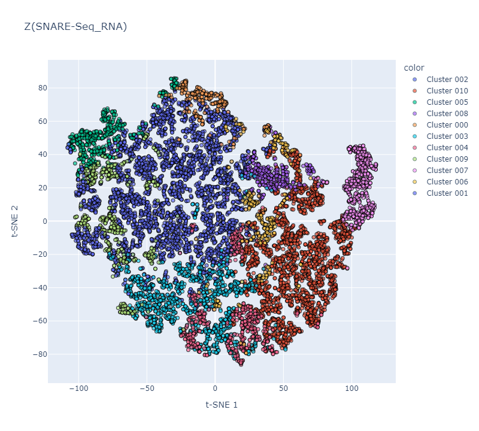
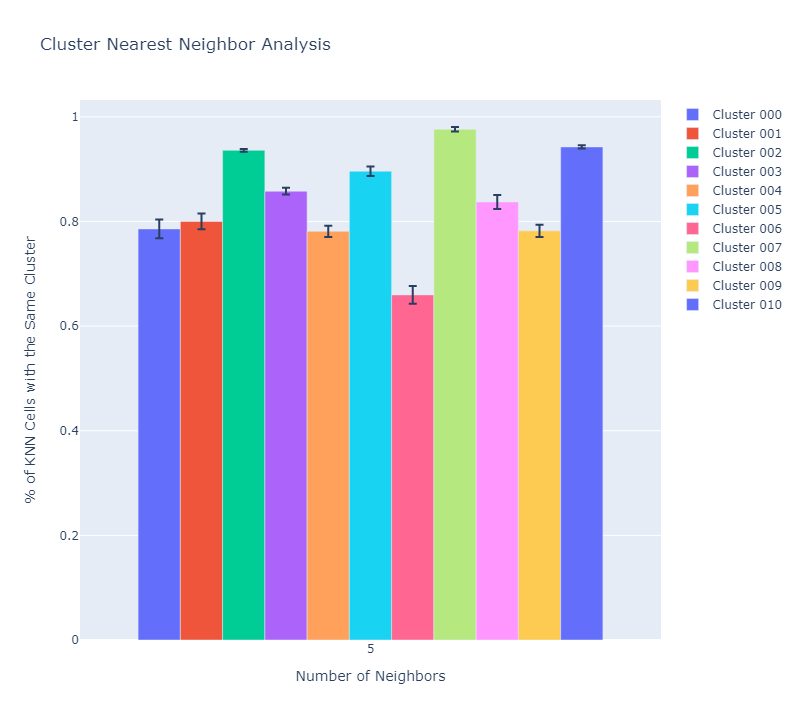

# CAVACHON (Under Development)
**C**ell cluster **A**nalysis with **V**ariational **A**utoencoder using **C**onditional **H**ierarchy **Of** latent representio**N** is the Tensorflow implementation of the research "_Using hierarchical variational autoencoders to incorporate conditional independent priors for paired single-cell multi-omics data integration_" (NeurIPS LMRL Workshop 2022 Under Review)
<!--by PH Hsieh, RX Hsiao, T Belova, KT Ferenc, A Mathelier, R Burkholz, CY Chen, GK Sandve, ML Kuijjer.-->

## Installation
```
pip install -r requirements.txt
pip install -e .
```

## Perform Analysis
### Input Preparation
Please refer to [config template](./sample_data/config_templates/README.md) for detail specification. 
The sample data can be downloaded here: [GSE126074 RNA](https://drive.google.com/file/d/1ONp7Z-ur7MIF6jfn_mez6EZDT48xJaNL/view?usp=sharing), [GSE126074 ATAC](https://drive.google.com/file/d/1lvLDWWFI4y13oaYYtNe6RHUsduy-rnj6/view?usp=sharing). The sample config can be found in `sample_data/config_templates`.

### Model Training
```python
from cavachon.workflow import Workflow

filename = os.path.realpath('config.yaml')
workflow = Workflow(filename)
workflow.run()
```

### Cluster Analysis
```python
from cavachon.tools import ClusterAnalysis

analysis = ClusterAnalysis(workflow.multi_modalities, workflow.model)
logpy_z = analysis.compute_cluster_log_probability(modality='RNA_Modality', component='RNA_Component')
knn = analysis.compute_neighbors_with_same_annotations(modality='RNA_Modality' 
    use_cluster='cluster_RNA_Component', use_rep='z_RNA_Component')
```
`logpy_z`: log-probability of sample `i` being assigned to cluster `j` given the (maximum likelihood estimation of) latent representation z.
```
array([[ -3.9341083 , -10.776552  ,  -0.5897913 , ...,  -3.9447799 ,
         -6.0016036 ,  -2.4596543 ],
       [ -7.0677404 , -13.149621  ,  -3.041152  , ...,  -1.9103765 ,
        -10.912442  ,  -0.9083605 ],
       [ -3.4757977 , -15.140064  ,  -2.1630888 , ...,  -1.154396  ,
        -11.829102  ,  -1.0539827 ],
       ...,
       [-28.104134  , -47.267155  , -26.313267  , ..., -14.6995    ,
        -41.663456  ,  -2.076253  ],
       [-25.175837  , -39.82096   , -22.512793  , ...,  -8.848755  ,
        -37.496826  ,  -0.18220711],
       [ -2.363697  , -15.275669  ,  -1.7070189 , ...,  -6.29113   ,
         -5.8308754 ,  -1.9263191 ]], dtype=float32)
```
`knn`: summary table for the k-nearest neighbor analysis.
```
        % of KNN Cells with the Same Cluster  Number of Neighbors      Cluster
0                                   1.000000                    5  Cluster 002
1                                   1.000000                    5  Cluster 010
2                                   0.400000                    5  Cluster 010
3                                   0.400000                    5  Cluster 010
4                                   1.000000                    5  Cluster 002
...                                      ...                  ...          ...
206175                              1.000000                   24  Cluster 008
206176                              0.958333                   24  Cluster 009
206177                              0.833333                   24  Cluster 007
206178                              0.500000                   24  Cluster 010
206179                              0.458333                   24  Cluster 006

[206180 rows x 3 columns]
```

### Differentially Expressed Gene Analysis
```python
from cavachon.tools import DifferentialAnalysis

obs = workflow.multi_modalities['RNA_Modality'].obs
index_a = obs[obs['cluster_RNA_Component'] == 'Cluster 001'].index
index_b = obs[obs['cluster_RNA_Component'] == 'Cluster 002'].index

analysis = DifferentialAnalysis(mdata=workflow.multi_modalities, model=workflow.model)
degs = analysis(group_a_index=index_a, group_b_index=index_b, component='RNA_Component', 
    modality='RNA_Modality')
```
`degs`: summary table of differentially expressed analysis using Bayesian factor.
```
                         P(A>B|Z)  P(B>A|Z)  K(A>B|Z)  K(B>A|Z)
SNARE-Seq_RNA:GeneNames                                        
0610007P14Rik            0.383407  0.616593 -0.475114  0.475114
0610009B22Rik            0.401319  0.598681 -0.399974  0.399974
0610009E02Rik            0.388315  0.611685 -0.454400  0.454400
0610009L18Rik            0.413333  0.586667 -0.350202  0.350202
0610009O20Rik            0.372564  0.627436 -0.521232  0.521232
...                           ...       ...       ...       ...
Prss57                   0.422747  0.576374 -0.311506  0.307904
RP23-171B16.5            0.459267  0.540733 -0.163292  0.163292
Scin                     0.443004  0.556996 -0.228981  0.228981
Slc32a1                  0.440989  0.559011 -0.237149  0.237149
Gm13688                  0.442711  0.557289 -0.230168  0.230168

[15637 rows x 4 columns]
```
### Gene Set Enrichment Analysis (GSEA)
```python
import gseapy

gene_sets = gseapy.get_library(name='KEGG_2019_Mouse', organism='Mouse')
prerank = degs['K(A>B|Z)']
prerank.index = prerank.index.str.upper()
gseapy.prerank(rnk=prerank, gene_sets=gene_sets, outdir='enrichment_analysis')
```


### Interactive Visualization
```python
from cavachon.tools import InteractiveVisualization

InteractiveVisualization.embedding(adata=workflow.mdata['RNA_Modality'], 
    use_rep='z_RNA_Component', width=800, height=720, filename='latent_space_rna.html')
```


```python
from cavachon.tools import InteractiveVisualization

InteractiveVisualization.neighbors_with_same_annotations(mdata=workflow.multi_modalities, 
    model=workflow.model, modality='RNA_Modality', use_cluster='cluster_RNA', use_rep='z_RNA', 
    n_neighbors_sequence=[5], group_by_cluster=True, width=800, height=720, 
    filename='nearest_neighbors_rna.png')
```


## For Developers
### Implement Custom Data Likelihood
1. The custom data distribution needs to be implemented by inherent the class `cavachon.distributions.Distribution`. The custom data distribution can also inherent from the `tensorflow_probability.distributions.Distribution`. In both cases, the class function `from_parameterizer_output` will need to be implemented. This function takes an Tensor as inputs (usually the output from a neural network that outputs the parameters for the distribution) and creates a  `tensorflow_probability.distributions.Distribution` object.
2. (Optional) Implement modifiers **before** loading batch of the data. This preprocessing step is particularlly important to avoid gradient overflow if the input is not bounded (see `cavachon.dataloader.modifiers`).
3. Implement modifiers for the preprocessor **after** loading batch of the data. This preprocessing step is particularlly important to avoid gradient overflow if the input is not bounded (see `cavachon.modules.preprocessors.modifiers`).
2. (Optional) Implement the parameterizer neural network (`tf.keras.layers.Layer`)(see `cavachon.layers.parameterizers`).
3. Implement the parameterizer neural network (`tf.keras.Model`) that can optionally used the layers created from step 2. to output the parameters for the custom distributions, including all the necessary modification. This postprocessing step is particularlly important to avoid gradient overflow if the input is not bounded. The class name needs to be the same name as the class name of the custom distribution for the `cavachon.utils.ReflectionHandler` to work (see `cavachon.modules.parameterizers`)


### Implement Custom Neural Network Architecture
Create a new class that inherent either the `cavachon.model.Model` or `cavachon.modules.components.Component`. Overwrite the builder class functions with custom neural networks. Currently support the following:
* `cavachon.model.Model`
  * `setup_inputs`: inputs for Tensorflow functional API. 
  * `setup_components`: components
  * `setup_outputs`: outputs for Tensorflow functional API. 
* `cavachon.module.components.Component`
  * `setup_inputs`: inputs for Tensorflow functional API.
  * `setup_preprocessor`: preprocessor to modify the inputs before encoding.
  * `setup_encoder`: encoder networks.
  * `setup_hierarchical_encoder`: hierarchical encoder that combine latent space of ancestors (or parents).
  * `setup_z_prior_parameterizer`: parameterizer for z prior (see Jiang et al., 2016 and Falck et al., 2021)
  * `setup_z_sampler`: reparameterization for z.
  * `setup_decoders` decoder networks.
  * `setup_outputs`: outputs for Tensorflow functional API. 

### Implement Custom Losses
1. Create custom losses (`tf.keras.losses.Loss`) (see `cavachon.losses`).
2. Modify the `train_step` and `compile` function of `cavachon.models.Model` and/or `cavachon.modules.components.Component`.

## Todos
* GSEA Analysis
* Command Line Execution
* Publish to PyPI
* Add Distributions
  * Independent Poisson distributions
  * Independent Zero-Inflated Poisson Distributions
  * Independent Negative Binomial Distributions
  * Independent Gaussian Distributions
* Implement weighted importance or mixture-of-experts in the components.
* 10X PBMCs 5k, 10k
* MUON API (?) 
* Heatmap of latent space
* Early stop, patience

